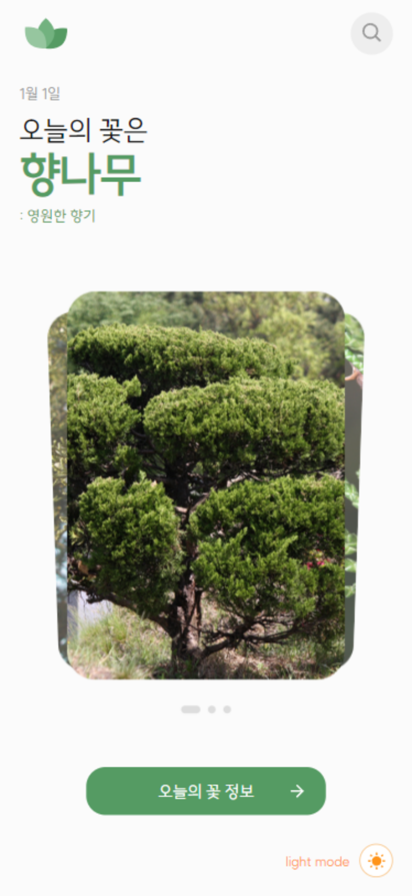

# 개인 프로젝트 : 오늘의 꽃 
✨ 링크 : [seoin-today-flower.netlify.app  ](https://seoin-today-flower.netlify.app/)✨  
<br>
react로 작업한 오늘의 꽃 (창작)
<br>

## 📣 프로젝트 소개
- 개인프로젝트
- react를 사용
- 공공api(농촌진흥청 국립원예특작과학원) 연결 후 서버 작업 완료

### 📅 작업 기간
- 2023년 11월 10일 ~ 2023년 11월 16일
- 디자인 1일 , 퍼블리싱 2일, 데이터 연결 4일

### 💻 사용 툴 및 작업 언어
- Adobe XD (디자인)
- Visual Studio Code
    - React, SCSS

<br>

## 🎮 주요기능
### 모바일 사이즈 위주
  #### 메인 페이지
  ##### styled-component 이용한 테마 변경
  |light mode|dark mode|
  |:---:|:---:|
  |||
  
  #### 검색 및 상세 페이지
  |이름 검색|날짜 검색|상세 페이지|
  |:---:|:---:|:---:|
  ||||

<br>
<br>

## 📌 프로젝트 작업하며 얻은 코드

<details>
  <summary>컴포넌트 노드 순서</summary>
  <br>

  - `BrowserRouter`을 처음엔 App.js에 작성했는데 index.js에 작성하는 것이 좋다고 하여 옮김

    ```javascript
      <BrowserRouter> //react-router-dom을 감싸는 최상단 => index.js App바깥으로 옮김!!!!!!
        <ThemeProvider theme={themeMode}> //styled-components 스타일을 전역적으로 공유. ThemeProvider로 감싼 하위들은 모두 theme props를 사용할 수 있다.
          <GlobalStyle /> //reset할 스타일과 styled-components 정의해서 글로벌로 사용 (지우면 동작 안함)
          <div className="App"> //.App
            <Header /> 
            <div className="content"> //Header가 fixed라 content 위로 여백 넣음
              <Routes> //Router 동작 될 부분
                <Route
                  path="/"
                  element={
                    <Main toggleTheme={toggleTheme} themeMode={themeMode} />
                  }
                />
                //Main안에 ThemeBtn 컴포넌트가 있는데 테마를 바꿔줄 버튼이라 Props 전달
                <Route path="/search" element={<Search />} />
                // 주소/search에 보여질 부분
              </Routes>
            </div>
          </div>
        </ThemeProvider>
      </BrowserRouter>
    ```
</details>

<details>
  <summary>뒤로가기 이벤트 만드는 법</summary>
  <br>

  ```javascript
    //라우터 라이브러리 제공
    import { useNavigate } from "react-router-dom";
    // 훅
    const navigate = useNavigate()
    // 클릭할 곳에 넣기만 하면 됨 (-1 = 뒤로 한 번 가기)
    <HeaderButton className="back" onClick={()=>{navigate(-1)}}>
  ```

  - 위치하는 페이지에 따라 헤더 아이콘 다르게 띄우기
  - 로고는 메인에서만, 그 외의 페이지에선 뒤로가기 아이콘을 띄워야 하는 상황
    ```javascript
      import { Link, useLocation } from "react-router-dom";
      const location = useLocation();

      //함수 
      const renderHeaderIcons = () => {
        if(location.pathname === '/') { ///현재 위치가 루트일 때 표시할 아이콘
          return(
            <Link to="/">
              
            </Link>
          )
        }else{ //그 외 페이지일 경우
          return(
            <HeaderButton className="back" onClick={()=>{navigate(-1)}}>
              <IoIosArrowBack className="icon" />
            </HeaderButton>
          )
        }
      }
      //...생략
      //함수만 넣어주면 된다.
      <div className="headerIcons">
        {renderHeaderIcons()}
      </div>
    ```
</details>

<details>
  <summary>리액트 스와이퍼 모듈 필수 연결</summary>
  <br>

  ```javascript
    //필수 불러오기
    import 'swiper/scss/pagination';
    //모듈 연결
    import { EffectCards, Pagination, Autoplay } from 'swiper/modules';
    // 코드 내 모듈에도 작성
    modules={[EffectCards, Pagination, Autoplay]}
  ```
</details>

<details>
  <summary>버튼에 따라 다른 input 나오는 법</summary>
  <br>

  ```javascript
  //useState 사용
    const handleButtonClick = (type) => {
      setSearchType(type);
    };
    // 버튼 만들고 각각 인자 입력
    <button onClick={() => handleButtonClick("name")}>꽃 이름</button>
    <button onClick={() => handleButtonClick("date")}>날짜</button>
    //클릭 시 노출할 영역에 작성
    {searchType === "name" && (
      <SearchInputBox>
        <input type="text" placeholder="꽃 이름을 검색해주세요" />
        <button className='SearchBtn'>
          <BiSearch className='icon'/>
        </button>
      </SearchInputBox>
    )}
    //...생략 위와 같이 하단에 date부분도 만들면 됨
  ```
</details>

<details>
  <summary>env에 환경변수 넣는 법</summary>
  <br>

  1. `server/server.js`는 src 안에 있어야 한다
    - 최상단루트에 놓았더니 "프로젝트 디렉토리 외부에 있는 모듈을 상대 경로로 import하려고 시도했을 때 발생"하는 오류가 뜸

  2. env파일은 최상단 루트(package.json와 동일한 위치)에 있어야 한다 
    - `REACT_APP_API_KEY = 키코드`
    - 변수 선언 않고 바로 입력
    - "",''로 묶을 필요 없다.
    - ;(세미콜론)이나 ,(쉼표) 넣기 않기
    - 변수명 앞에는 `REACT_APP_`이 꼭 붙어야 한다.
</details>

<details>
  <summary>검색 페이지 2월 윤달 고정</summary>
  <br>

  - react의 `<select>` 요소의 `value` 속성은 문자열을 반환한다. (HTML에서 `<select>` 요소의 `value` 속성이 문자열이어야 하기 때문)
  - 리액트는 `===` 를 권장하기 때문에 2월에 29일을 추가하려면 문자형으로 비교해야 한다.
  <br>
    ```javascript
    const daysInMonth = (month, year) => {
        if (month === "2") {
          console.log('month: ', month);
          return 29;
        }
        return new Date(year, month, 0).getDate();
      };
    ```
</details>

<details>
  <summary> ❗ 갑자기 서버가 끊기고 영 이상하다면? </summary>
  <br>
  - 오류 넘버 보고 공문서 확인

  - `22 (LIMITED NUMBER OF SERVICE REQUESTS EXCEEDS ERROR)`
    -  서비스 요청제한횟수 초과에러 (일별 요청한도 등)
</details>
